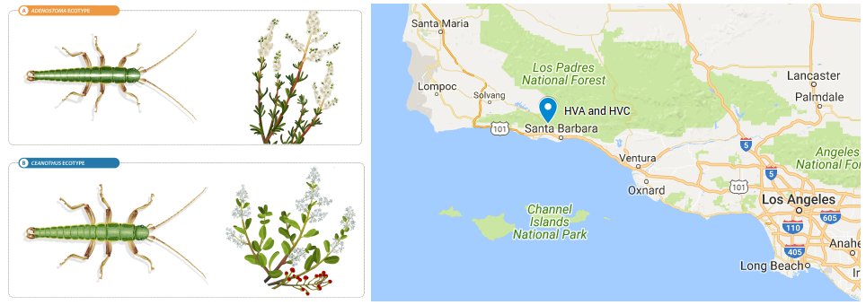
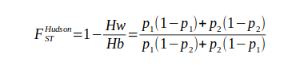

*Population Genomics Workshop 2018, University of Sheffield*

# Delimitation of contiguous regions of differentiation using Hidden Markov Models (HMM)

#### Victor Soria-Carrasco

The aim of this practical is to estimate differentiation (i.e. F<sub>ST</sub>) between a pair of populations and identify contiguous regions of accentuated differentiation across the genome using a Hidden Markov Model (HMM) approach. We are going to use whole genome data of a pair of parapatric populations of *Timema cristinae* stick insects that live on different host plants and experience different selective pressures. The HVA population was sampled from *Adenostoma*, where bugs with a white strip are favoured, whereas the HVC population was sampled from *Ceanothus*, where green bugs have an advantage. This data belongs to larger dataset of four population pairs used in [Soria-Carrasco et al. 2014](http://science.sciencemag.org/content/344/6185/738). In that work, an approach similar to that of [Hofer et al. 2012](https://bmcgenomics.biomedcentral.com/articles/10.1186/1471-2164-13-107) was followed to investigate parallel evolution by identifying unique and shared regions of accentuated differentiation in four pairs of natural populations.  



Data and scripts used during this practical will be available in a shared folder in Iceberg, the University of Sheffield HPC cluster, which will allow faster transfers. However, in case attendees would like to use it for practice after the workshop, scripts are also available in [this repository](https://github.com/visoca/popgenomworkshop-hmm) and data can be downloaded [here](https://drive.google.com/file/d/1w9g9vHGDmt8LUiqeGeI0DP6aOSo7O_iK/view?usp=sharing) (and results [here](https://drive.google.com/file/d/1_FUNj1S3GwerRVPHlhDG5Emp3rAVRo1p/view?usp=sharing)). The source code of ```estpEM```, the program used to estimate allele frequencies from genotype likelihoods, is available [here](https://bitbucket.org/visoca/transitions_genomic_differentiation_timema/src/c662bf2ddeb03f8b4de934d88c4397052c1931f4/fst/estpEM_2014-10-08.tar.gz?at=master).

### Resources
* [Bhatia et al. 2013](http://genome.cshlp.org/content/23/9/1514.full) - Excellent paper about F<sub>ST</sub> estimation and interpretation.
* [Hofer et al. 2012](https://bmcgenomics.biomedcentral.com/articles/10.1186/1471-2164-13-107) - First study where HMMs were used to delimit regions of differentiation.
* [Wolf & Ellegren 2017](https://www.nature.com/articles/nrg.2016.133) - Review about what different evolutionary processes can generate genomics islands of elevated differentiation.
* [HMM](https://cran.r-project.org/web/packages/HMM/index.html) - R package to fit Hidden Markov Models


## 1. Initial set up
We are going to create a working directory in a dedicated space in the HPC cluster (/data/$USER) and copy the necessary scripts and data files to run this practical.

Connect to Iceberg HPC cluster (change *myuser* by your username):
```bash
ssh myuser@iceberg.sheffield.ac.uk
```
Request an interactive session:
```bash
qrsh
```
#### Important note
***
This tutorial relies on having access to a number of programs. The easiest way is to have your account configured to use the Genomics Software Repository. If that is the case you should see the following message when you get an interactive session with ```qrsh```:
```
  Your account is set up to use the Genomics Software Repository
     More info: http://soria-carrasco.staff.shef.ac.uk/softrepo
```
If you don't get that message, follow the instructions [here](http://soria-carrasco.staff.shef.ac.uk/softrepo/) to set up your account.

In addition, if you want to configure the ```nano``` text editor to have syntax highlighting and line numbering, you can configure it this way:
```bash
cat /usr/local/extras/Genomics/workshops/January2018/.nanorc >> /home/$USER/.nanorc
```
***

#### Note on transferring output files to your local computer for visualization
***
You probably will want to transfer files to your own computer for visualization (especially the images). In Linux and Mac, you can do that using rsync on the terminal. For example, to transfer one of the png files or all the results that are generated in this practical, the command would be: 
```bash
# transfer png file
rsync myuser@iceberg.sheffield.ac.uk:/data/myuser/fst_hmm/timemaHVAxHVC.fst.png ./
# transfer all results
rsync myuser@iceberg.sheffield.ac.uk:/data/myuser/fst_hmm/*.* ./
```
Another possibility is to email the files, for example:
```bash
echo "Text body" | mail -s "Subject: gemma - hyperparameter plot" -a /data/myuser/fst_hmm/timemaHVAxHVC.fst.png your@email
```
Graphical alternatives are [WinSCP](http://dsavas.staff.shef.ac.uk/software/xconnect/winscp.html) or [Cyberduck](http://www.macupdate.com/app/mac/8392/cyberduck). You can find more detailed information [here](https://www.sheffield.ac.uk/wrgrid/using/access).
***

Change to your data directory:
```bash
cd /data/$USER/
```
Create the working directory for this practical:
```bash
mkdir fst_hmm
```
Copy scripts:
```bash
cp -r /usr/local/extras/Genomics/workshops/January2018/fst_hmm/scripts ./fst_hmm
```
Copy data:
```bash
cp -r /usr/local/extras/Genomics/workshops/January2018/fst_hmm/data ./fst_hmm/
```
To check you are getting the expected results, you can also copy a directory containing all the files that should be produced after running this practical:
```bash
cp -r /usr/local/extras/Genomics/workshops/January2018/fst_hmm/results ./fst_hmm/
```
Change to the working directory we are going to use for this practical:
```bash
cd fst_hmm
```

## 2. Data formatting
Now let's have a look at the data.
You should have the following input files:
```bash
ls -lh data
```

>total 2.5G<br>
>-rw-r--r-- 1 myuser cs  22K Jan 26 12:31 lg_ord_sca_length.dsv<br>
>-rw-r--r-- 1 myuser cs 768M Jan 26 12:31 timemaHVA.gl<br>
>-rw-r--r-- 1 myuser cs 467M Jan 26 12:31 timemaHVA.vcf.gz<br>
>-rw-r--r-- 1 myuser cs 781M Jan 26 12:31 timemaHVC.gl<br>
>-rw-r--r-- 1 myuser cs 476M Jan 26 12:31 timemaHVC.vcf.gz<br>

There is a vcf file containing single nucleotide polymorphisms (SNPs) from whole genome sequences of 20 individuals for each population (HVA and HVC). vcf is a very popular format for genetic variants, you can find more info [here](http://www.internationalgenome.org/wiki/Analysis/vcf4.0/). You can have a look at the file content with the following commands:
```bash
gzip -dc data/timemaHVA.vcf.gz | less -S
# or with bcftools
bcftools view data/timemaHVA.vcf.gz | less -S
# excluding long header
bcftools view -H data/timemaHVA.vcf.gz | less -S
```
They need to be converted to the stripped down format (*gl*, genotype likelihood) required for ```estpEM```, the program we are going to use for allele frequency estimation later. This is done with a custom Perl script called ```bcf2gl.pl```, which has a very simple syntax. For example, to convert the file for the HVA population, we would use the command:
```bash
scripts/bcf2gl.pl -i data/timemaHVA.vcf.gz -o timemaHVA.gl
```
To speed things up by processing the files in the cluster in parallel in different nodes, we will be using an [SGE array job](http://docs.hpc.shef.ac.uk/en/latest/parallel/JobArray.html) that calls the Perl script for each file. Let's have a look at the ```bcf2gl.sh``` script with the text editor nano:
```bash
nano scripts/bcf2gl.sh
```
```bash
#!/bin/bash
#$ -l h_rt=1:00:00
#$ -l rmem=8g
#$ -t 1-2
#$ -j y
#$ -o bcf2gl.log

# Convert bcf/vcf to gl format
# (required for estpEM)

BCF2GL="/data/$USER/fst_hmm/scripts/bcf2gl.pl"

INDIR="/data/$USER/fst_hmm"

# array of input files
INPUT=('data/timemaHVA.vcf.gz' 'data/timemaHVC.vcf.gz')
# array of output files
OUTPUT=('timemaHVA.gl' 'timemaHVC.gl')
# array of log files
LOG=('timemaHVA.bcf2gl.log' 'timemaHVC.bcf2gl.log')

# Take index from SGE task id
I=$(($SGE_TASK_ID-1))

hostname > ${LOG[$I]}
uname -a >> ${LOG[$I]}
date >> ${LOG[$I]}
echo "----------------------------------------------------------" >> ${LOG[$I]}
echo >> ${LOG[$I]}

$BCF2GL -i ${INPUT[$I]} -o ${OUTPUT[$I]} >> ${LOG[$I]} 2>&1

echo  >> ${LOG[$I]}
echo "----------------------------------------------------------" >> ${LOG[$I]}
date  >> ${LOG[$I]}
```
Submit the job using the command:
```bash
qsub scripts/bcf2gl.sh
```
You can check the status of your jobs with ```Qstat```. Jobs would take ~10 min per file to run, but if you don't want to wait, you can use the files provided in the data folder after deleting the job (replace #jobid with the actual job id):
```bash
qdel #jobid
cp -r data/*.gl ./
```
Output .gl files should look like this:
```bash
less -S timemaHVA.gl
```
>20 4391556<br>
>timemaHVA_8021022 timemaHVA_8021024 timemaHVA_8021026 timemaHVA_8021027 timemaHVA_8021028 timemaHVA_<br>
>1 1 1 1 1 1 1 1 1 1 1 1 1 1 1 1 1 1 1 1<br>
>lg01_ord0000_scaf00353:8612 0 0 0 0 0 0 0 6 75 0 6 7 0 15 85 0 6 41 0 3 34 0 3 4 0 0 0 0 9 46 0 <br>
>lg01_ord0000_scaf00353:8752 0 9 6 0 12 10 0 3 37 0 6 7 29 0 6 0 24 71 0 7 14 0 18 12 0 12 70 0 9<br>
>lg01_ord0000_scaf00353:8758 0 12 11 0 18 19 0 3 40 0 6 7 0 6 45 0 24 77 0 39 60 0 21 16 0 9 42 0<br>
>lg01_ord0000_scaf00353:8770 0 12 11 0 18 19 0 6 69 0 6 7 0 6 44 0 24 72 0 42 62 0 27 20 0 6 7 0 <br>
>lg01_ord0000_scaf00353:8772 0 12 11 0 18 19 0 6 67 0 6 7 0 6 39 0 24 73 0 13 17 0 27 20 0 6 7 0 <br>
>lg01_ord0000_scaf00353:8797 0 15 14 0 18 43 0 6 72 0 6 7 0 6 45 0 24 48 0 40 26 0 30 22 0 9 40 0<br>
>lg01_ord0000_scaf00353:8838 0 12 11 0 12 37 0 3 40 0 6 7 0 0 0 0 18 12 0 18 5 0 24 29 0 9 43 0 9<br>
>lg01_ord0000_scaf00353:8845 0 12 11 22 0 0 40 3 0 0 6 7 0 3 37 0 15 12 0 54 82 0 21 23 29 0 0 34<br>
>lg01_ord0000_scaf00353:8851 0 12 11 0 12 43 0 3 35 0 9 9 0 3 39 0 15 12 0 51 84 0 18 16 0 9 41 0<br>
>lg01_ord0000_scaf00353:8862 0 12 11 0 6 39 0 3 34 0 9 9 0 3 33 0 15 12 0 48 79 0 21 16 0 9 43 0 <br>

The first line shows the number of samples and the number of SNPs, the second line show the samples ids, and the third line specifices what samples will be used for analyses. The lines below represent a SNP per line. The first field is the id (scaffold:position in this case) and it is followed by the phred scaled genotype likelihoods for the three possible genotypes (all variants are biallelic) for each individual. Therefore there are 3 x number of samples fields genotype likelihoods on each line.

## 3. Allele frequency estimation
We will infer allele frequencies from genotype likelihoods by maximum likelihood, using an implementation of the iterative soft expectation-maximization algorithm (EM) described in [Li 2011](https://www.ncbi.nlm.nih.gov/pmc/articles/PMC3198575/) and also used in bcftools. This algorithm has been implemented in the program ```estpEM```, withcode kindly provided by [Zach Gompert, Utah State University](https://gompertlab.wordpress.com/)). As before, we are going to use and SGE array job to parallelize jobs. In this case it will run ```estpEM``` to estimate allele frequencies from genotype likelihoods. You can have a look at the script:

```bash
nano scripts/alfreq.sh
```
```bash
#!/bin/bash
#$ -l h_rt=1:00:00
#$ -l rmem=8g
#$ -l mem=16g
#$ -t 1-2
#$ -j y
#$ -o alfreq.log

# Estimate allele frequencies from genotype likelihoods
# by maximum-likelihood; estpEM implements the 
# Li 2012 expectation-maximization (EM) algorithm 
# (also used in bcftools)

ESTPEM='estpEM'

INDIR="/data/$USER/fst_hmm"

# array of input files
INPUT=('timemaHVA.gl' 'timemaHVC.gl')
# array of output files
OUTPUT=('timemaHVA.alfreq.txt' 'timemaHVC.alfreq.txt')
# array of log files
LOG=('timemaHVA.alfreq.log' 'timemaHVC.alfreq.log')
# Take index from SGE task id
I=$(($SGE_TASK_ID-1))

hostname > ${LOG[$I]}
uname -a >> ${LOG[$I]}
date >> ${LOG[$I]}
echo "----------------------------------------------------------" >> ${LOG[$I]}
echo >> ${LOG[$I]}

$ESTPEM -i ${INPUT[$I]} -o ${OUTPUT[$I]} -h 2  >> ${LOG[$I]} 2>&1

echo  >> ${LOG[$I]}
echo "----------------------------------------------------------" >> ${LOG[$I]}
date  >> ${LOG[$I]}
```
Submit the job using the command:
```bash
qsub scripts/alfreq.sh
```
You can check the status of your jobs with ```Qstat```. Each job task should take less than 5 min per file to run. When finished, we can have a look at the log files:
```bash
less -S timemaHVA.alfreq.log
```
It should look like this:
>node211<br>
>Linux node211 2.6.32-696.18.7.el6.x86_64 #1 SMP Wed Jan 3 19:31:16 CST 2018 x86_64 GNU/Linux<br>
>Fri Jan 26 18:36:16 GMT 2018<br>
>----------------------------------------------------------<br>
><br>
>Reading data from timemaHVA.gl<br>
>Number of loci: 4391556<br>
>Number of individuals: 20<br>
>Using EM algorithm to estimate allele frequencies<br>
>Writing results to timemaHVA.alfreq.txt<br>
>Runtime: 0 hr 1 min 11 sec<br>
><br>
>----------------------------------------------------------<br>
>Fri Jan 26 18:37:28 GMT 2018<br>

And to the output text files:
```bash
less -S timemaHVA.alfreq.txt
```
That should look like this:
>lg01_ord0000_scaf00353:8612 0.2074 0.0006<br>
>lg01_ord0000_scaf00353:8752 0.1963 0.0674<br>
>lg01_ord0000_scaf00353:8758 0.1250 0.0001<br>
>lg01_ord0000_scaf00353:8770 0.1199 0.0001<br>
>lg01_ord0000_scaf00353:8772 0.1791 0.0408<br>

The columns are: locus, allele frequency from counts, and allele frequency inferred by maximum likelihood. Now where going to merge the results from both populations into a single file:

```bash
# create header
echo -e "locus\tafHVA\tafHVC" > timemaHVAxHVC.alfreq.txt

# join files by locus (1st field), retain only locus id (1st field) and ML AFs (3rd and 5th fields)
join -j 1 timemaHVA.alfreq.txt timemaHVC.alfreq.txt | \
awk '{OFS="\t"; print $1,$3,$5}' >> timemaHVAxHVC.alfreq.txt

# show file
less -S timemaHVAxHVC.alfreq.txt
```
>locus afHVA afHVC<br>
>lg01_ord0000_scaf00353:8612 0.0006 0.0005<br>
>lg01_ord0000_scaf00353:8752 0.0674 0.1185<br>
>lg01_ord0000_scaf00353:8758 0.0001 0.0201<br>
>lg01_ord0000_scaf00353:8770 0.0001 0.0000<br>
>lg01_ord0000_scaf00353:8772 0.0408 0.0263<br>

## 4. F<sub>ST</sub> estimation
We are going to calculate genetic differentiation between two populations and for a large
number of variants using F<sub>ST</sub>. We are going to use the F<sub>ST</sub> Hudson's estimator for every SNP:



where *Hw* is the within-population heterozygosity, *Hb* is the between-population heterozygosity, and *p<sub>1</sub>* and *p<sub>2</sub>* are the allele frequencies in each population.

We are going to use the code provided in the script ```fst.R``` for F<sub>ST</sub> estimation. This script can be run in batch mode like executing: ```Rscript scripts/fst.R```, but you are likely to learn much more if you follow the steps below to run it step by step. Be aware that this is ```R``` code and will have to run within an ```R``` session. Open an R session simply typing the command ```R```.

First we change the working directory:
```R
user<-Sys.getenv("USER")
wkpath<-paste("/data/",user, "/fst_hmm",sep="")
setwd(wkpath)
```
And then we load a library that will greatly speed up the loading of bit files:
```R
# load library to speed up loading of big tables
library(data.table)
```
This is the function to calculate Hudson's F<sub>ST</sub>:
```R
# function to calculate Hudson's Fst
# --------------------------------------------------
hudsonFst<-function(locus=NA, p1=NA, p2=NA){
    numerator<-p1 * (1 - p1) + p2 * (1 - p2) 
    denominator<-p1 * (1 - p2) + p2 * (1 - p1) 
    fst<-1 - numerator/denominator
    out<-data.frame(locus,numerator,denominator,fst)
    return(out)
}
# --------------------------------------------------
```
Then we load allele frequencies:
```R
# load file with allele frequencies
pops.af<-fread("timemaHVAxHVC.alfreq.txt", header=T, sep="\t")
# check table
head(pops.af)
```
and now calculate the F<sub>ST</sub>s for every SNP:
```R
# Calculate Fst for all loci
fst.HVAxHVC<-hudsonFst(locus=pops.af$locus, p1=pops.af$afHVA,p2=pops.af$afHVC)
# check results
head(fst.HVAxHVC)
```
Write results to file:
```R
# Write table to file
write.table(fst.HVAxHVC, file="timemaHVAxHVC.fst.dsv", 
                quote=F, row.names=F, sep="\t")
```
And plot the F<sub>ST</sub> histogram to a png file (you can download this image to your own computer for visualisation):
```R
# plot FST histogram to png file
png(filename="timemaHVAxHVC.fst.png", width=1600, height=1200)
hist(fst.HVAxHVC$fst, breaks=100)
dev.off()
```
Now genome-wide F<sub>ST</sub> statistics are calculated as "ratio of averages" (i.e. averaging the variance components - numerator and denominator - separately), as suggested in [Bhatia et al. 2013](http://genome.cshlp.org/content/23/9/1514.full)
```R
# Genome-wide FST statistics
# ------------------------------------------------------------------------------
# Calculate genome-wide FST as "ratio of averages" following Bhatia et al. 2013
nloci<-length(na.exclude(fst.HVAxHVC$fst))
fst.mean<-1-((sum(fst.HVAxHVC$numerator)/nloci)/(sum(fst.HVAxHVC$denominator)/nloci))
fst.mean
```
You can see "average of ratios" (i.e. mean of F<sub>ST</sub>s) produces a noticeable different (underestimated) value:
```R
# "average of ratios" yields a noticeable lower value
mean(fst.HVAxHVC$fst,na.rm=T)
```
Calculate median, upper quantiles (95%, 99%, 99.9%, 99.99%), and max:
```R
# median and upper quantiles for all loci
fst.quantile<-quantile(fst.HVAxHVC$fst, prob=c(0.5,0.95,0.99,0.999,0.9999), na.rm=T)
fst.quantile

# max
fst.max<-max(fst.HVAxHVC$fst,na.rm=T)
fst.max

# put all together in a vector
fst.genome<-c("genome",nloci,fst.mean,fst.quantile,fst.max)
# ------------------------------------------------------------------------------
```
Calculate F<sub>ST</sub> separately for each major linkage group (~chromosomes):
```R
# FST stats by linkage group
# ------------------------------------------------------------------------------
# get linkage groups from loci names
lgs<-unique(gsub("_ord.*","", fst.HVAxHVC$locus))

# function to get fst (including median and quantiles) for a linkage group
fst.lg<-function(lg){
              fst<-fst.HVAxHVC[grep(paste("^",lg,"_",sep=""), fst.HVAxHVC$locus),]
              nloci<-length(na.exclude(fst$fst))
              fst.mean<-1-((sum(fst$numerator)/nloci)/(sum(fst$denominator)/nloci))
              fst.quantile<-quantile(fst$fst, prob=c(0.5,0.95,0.99,0.999,0.9999), names=F, na.rm=T)
              fst.max<-max(fst$fst, na.rm=T)
              return(c(nloci=nloci,mean=fst.mean,fst.quantile,fst.max))
            }

# calculate fst for each linkage group
fst.stats.lgs<-lapply(lgs, fst.lg)

# put them together in a data frame
fst.stats.lgs<-data.frame(lg=lgs,do.call("rbind",fst.stats.lgs),stringsAsFactors=F)
# ------------------------------------------------------------------------------
```
Put together F<sub>ST</sub> estimates for whole genome and linkage groups and write to a text file:
```R
# summarize results
# ------------------------------------------------------------------------------
# put together whole genome and lgs estimates
fst.stats<-rbind(fst.genome,fst.stats.lgs)

# put names of columns
colnames(fst.stats)<-c("lg","nloci","mean","median","q95%","q99%","q99.9%","q99.99%","max")

# and check
fst.stats

# Write summary table to file
write.table(fst.stats,file="timemaHVAxHVC.lgs.fst.dsv",
            quote=F, row.names=F, sep="\t")
# ------------------------------------------------------------------------------
```

Remember to quit the ```R``` session when finished:
```R
quit()
```

## 4. Delimitation of contiguous regions of differentiation using a HMM model
We will use a 3-state discrete homogeneous Hidden Markov Model (HMM) to delimit contiguous regions of genetic differentiation, following the approach of [Hofer et al. 2012](https://bmcgenomics.biomedcentral.com/articles/10.1186/1471-2164-13-107). We will use the package [```HiddenMarkov```](https://cran.r-project.org/web/packages/HiddenMarkov/index.html) to classify the genome in regions of low, medium, and high differentiation (LDI, IDI, and HDI, respectively). This will allow to investigate the number, size, and distribution of regions of differentiation across the genome (and potentially under selection). We are going to use the code provided in the script ```fitHMM.R``` for that. This script can be run in batch mode like executing: ```Rscript scripts/fit_hmm.R```, but you are likely to learn much more if you follow the steps below to run it step by step. Be aware that this is ```R``` code and will have to run within an ```R``` session. Open an R session simply typing the command ```R```.

First we change the working directory:
```R
user<-Sys.getenv("USER")
wkpath<-paste("/data/",user, "/fst_hmm",sep="")
setwd(wkpath)
```
And then we load the package ```HiddenMarkov``` to fit HMMs and ```data.table``` to speed up loading big files:
```R
# library to fit Hidden Markov Models
library(HiddenMarkov)

# library to speed up loading of big tables
library(data.table)
```

We will use a custom function called ```Mstep.normc``` (based on the ```Mstep.norm``` included in the ```HiddenMarkov``` package) to model the observed states (i.e. F<sub>ST</sub>) as a normal with the standard deviation fixed to the genome-wide F<sub>ST</sub> standard deviation estimate. This function will be used for fitting a HMM later.
```R
# Modified version of Mstep.norm for fitting HMM below
# ------------------------------------------------------------------------
# here the standard deviation is fixed to the values specified in pm$sd 
Mstep.normc <- function(x, cond, pm, pn){
  nms <- sort(names(pm))
  n <- length(x)
  m <- ncol(cond$u)
  if (all(nms==c("mean", "sd"))){
    mean <- as.numeric(matrix(x, nrow = 1) %*% cond$u)/apply(cond$u, 
       MARGIN = 2, FUN = sum)
    sd <- pm$sd
    return(list(mean=mean, sd=sd))
  }
}
rnormc <- rnorm
dnormc <- dnorm
pnormc <- pnorm
qnormc <- qnorm
```
Now we load the data:
```R
# Prepare data
# ------------------------------------------------------------------------
# Load Fst if need be
fst.HVAxHVC<-fread("timemaHVAxHVC.fst.dsv", header=T, sep="\t")
```
and restrict the analyses to a single linkage group:
```R
# Use only one linkage group for this example
fst<-fst.HVAxHVC[grep("^lg01_", fst.HVAxHVC$locus),]$fst
#fst<-fst.HVAxHVC[grep("^lg08_", fst.HVAxHVC$locus),]$fst
```
F<sub>ST</sub> is transformed using a logit function so that we can assume a normal distribution of F<sub>ST</sub> for each HMM state. Missing and very low F<sub>ST</sub> values that may result in "NA" or "Inf" values after transformation are replaced by low, but tractable F<sub>ST</sub> values (i.e. 1e-9) beforehand. We also store the number of SNPs, the mean and the standard deviation of logit F<sub>ST</sub>s, as these values will be used later.
```R
# Replace mising and too low Fst values by tractable value
fst[is.na(fst)]<-1e-9
fst[fst<1e-9]<-1e-9

# logit transform Fst, we will assume a normal logit distribution 
# for each HMM state
lfst<-log(fst/(1-fst))

# nloci, mean and sd (used below)
nloci<-length(lfst)
mean.lfst<-mean(lfst)
sd.lfst<-sd(lfst)
# ------------------------------------------------------------------------
```
We now will fit a homogenous Hidden Markov Model of 3 discrete states: high (1), medium (2), and low (3) differentiation. We will use a reasonable starting transition matrix: low transition rates to and from medium state, but disallowing direct transitions between extremes (from low to high or high to low). It is highly recommended to run the algorithm multiple times (tens, hundreds, or even thousands) using different starting matrices, because the maximum-likelihood searching algorithm could be stuck in local optima. We will not do this in this practical for time reasons, but code to generate random matrices is included.
```R
# Fit homogenous HMM of 3 discrete states
# ------------------------------------------------------------------------
# initial m x m transition probability matrix
# disable transitions from 1 to 3 and 3 to 1 (set value to zero) 
# (direct transitions from low to high and high to low differentiation)
Pi<-matrix(c(0.9,0.1,0,
             0.05,0.9,0.05,
             0,0.1,0.9),nrow=3,byrow=T)
Pi
# it is strongly recommended to run the EM algorithm multiple times (hundreds
# or thousands) with different starting matrices to avoid maximum-likelihood
# local optima; e.g. code to produce 100 random matrices:
# random.matrix<-function(x){
#                   x<-runif(3)
#                   matrix(c(x[1],1-x[1],0,
#                            x[2]/2,1-x[2],x[2]/2,
#                            0,x[3],1-x[3]),nrow=3,byrow=T)}
# matrices<-lapply(1:100, random.matrix)
```
We also set an initial marginal probability distribution for the m hidden states (delta) and a list with the initial values for the distribution of observed process (i.e. logit F<sub>ST</sub>; pm). In this case the distribution is a normal with the standard deviation fixed to the standard deviation estimated genome-wide and reasonable starting values for the means around the genome-wide mean.
```R
# initial marginal probability distribution of the m hidden states
delta<-c(0,1,0)

# initial list of parameter values associated with the distribution 
# of observed process
# they must coincide with the parameters of the function use
# we are using a normal and must give 3 means and 3 sds
pm<-list(mean=c(mean.lfst*0.9,mean.lfst,mean.lfst*1.1),
         sd=rep(sd.lfst,3))
```

We finally set a discrete time HMM object with the initial values of the transition probability matrix (Pi), the marginal probabily distribution of the hidden states (delta) at the start, using a modified normal distribution (normc) with variance fixed to the initial genome-wide variance estimate, and a list of initial observed process values (pm). 
```R
# set discrete time HMM object and initial values 
# normc is modified distribution so that variance is fixed
# to genome-wide estimate (sd.lfst)
init<-dthmm(x=lfst,
            Pi=Pi,
            delta=delta,
            distn="normc",
            pm=pm,
            discrete=FALSE)
```
We estimate the parameters of our HMM using the Baum-Welch EM algorithm. This will take a few minutes.
```R
# estimate parameters of HMM using Baum-Welch EM algorithm
# this may take a while (a few minutes)

# set maximum number of iterations and convergence criterion
ctrl<-bwcontrol(maxiter=1000, tol=1e-6)

# run BaumWelch algorithm
paramHMM<-BaumWelch(init, ctrl)

# compare initial and estimated transition matrices
# initial
Pi
# estimate
paramHMM$Pi

# compare initial and estimated distribution parameters
# (normal means and sds)
# initial
pm
# estimate
paramHMM$pm
```
Lastly we infer the sequence of Markov hidden states using the Viterbi algorithm (i.e. state for each loci: low, medium, or high). This will take less than 1 minute.
```R
# predict Markov states using Viterbi algorithm
fitHMM<-Viterbi(paramHMM)
# ------------------------------------------------------------------------------
```

and summarize the results:
```
# Summarize results
# ------------------------------------------------------------------------------
# mean FSTs of each state: high, medium, and low differentiation
# (reverse transform logit FSTs means)
fst.states<-round(1/(1+exp(-1 * paramHMM$pm$mean)),5)
fst.states

# number of loci in each state
nloci.states<-table(fitHMM)

# proportion of loci in each state
proploci.states<-nloci.states/nloci
proploci.states

# number of contiguous regions for each state
nregions.states<-unlist(lapply(1:3,
                    function(x) sum((fitHMM==x)[1:(nloci-1)]-(fitHMM==x)[2:nloci]==1)))
nregions.states

# put everything together in a table
summary.table<-cbind(state=c(1,2,3),
               mean.fst=fst.states,
               nloci=nloci.states,
               proploci=proploci.states,
               nregions=nregions.states)
# show table
summary.table

# save to file
write.table(summary.table, file="fst_hmm_lg01_regions_summary.dsv",
              quote=F, row.names=F, sep="\t")
# ------------------------------------------------------------------------------
<
```
We are going to plot the regions using a low, medium, and high differentiation legend
```R
# plot regions using differentiation legend
# Plot to a png file because the number of dots is very high
# drawing this kind of plot over the network is very slow
# also opening vectorial files with many objects is slow
# ------------------------------------------------------------------------------
png("fst_hmm_lg01.png", width=4000, height=1000)
par(mar=c(10,12,10,4)+0.1)
colours<-c("red","dark grey","blue")
plot(fst, col=colours[fitHMM], ylim=c(0,0.8),
     xlab="relative position", ylab=expression("F"[ST]), main="regions of differentiation",
     cex=1, cex.axis=4, cex.lab=4, cex.main=4, mgp=c(7,3,0))

# add horizontal line to illustrate top 0.1% FST values
abline(h=quantile(fst, prob=0.999,na.rm=T), col="black", lty=3, cex=4, lwd=3)
text (0,quantile(fst, prob=0.999,na.rm=T)+0.025, label=expression("">=" 0.1%"), adj=1, pos=2, cex=3)

# legend
legend("topright",legend=c("high", "medium", "low"), 
       pch=1, col=colours, title="differentiation", bty="n", cex=4)
dev.off()

# ------------------------------------------------------------------------------
```
We have obtained the size of the regions in number of SNPs so far, let's get the actual size in base pairs. First, we use a function to get the size of regions in bp given their coordinates (lb=lower boundaries, ub=upper boundaries) and some information about the lenght and order of the scaffolds in the linkage groups. This has an extra complication because of the particularities of the *T. cristinae* draft genome, where scaffolds were assigned to linkage groups in a particular order using additional genetic information from crosses. Actually, the values obtained here are only approximations, because although the order of the scaffolds in a linkage group is known, the distance among them (i.e. the number of bp) is not.
```R
# function to get size of regions
# ------------------------------------------------------------------------------
get.regions<-function(lb=NA,ub=NA, loci.ord=NA, loci.pos=NA, lgordscalen=NA){
  nregions<-length(lb)
  bpsize<-numeric(nregions)
  for (i in 1:nregions){
    if (is.na(loci.ord[lb[i]]) || is.na(loci.ord[ub[i]])){
      cat ("I: ", i, "\n")
    }
    if (loci.ord[lb[i]] == loci.ord[ub[i]]){ # same scaffold
      bpsize[i]<-loci.pos[ub[i]]-loci.pos[lb[i]]
    }
    else{
      bpsize[i]<-(lgordscalen[lgordscalen$ord==loci.ord[lb[i]],]$length
                  -loci.pos[lb[i]]
                  +sum(lgordscalen[(lgordscalen$ord>loci.ord[lb[i]] &
                                    lgordscalen$ord<loci.ord[ub[i]]),]$length)
                  +loci.pos[ub[i]])
    }
  }

  regions<-data.frame(lb.ord=loci.ord[lb], ub.ord=loci.ord[ub],
                      lb.sca=loci.sca[lb], ub.sca=loci.sca[ub],
                      lb.pos=loci.pos[lb], ub.pos=loci.pos[ub],
                      length=bpsize)
  return(regions)
}
# ------------------------------------------------------------------------------
```
We need to get some info about the order an size of the scaffolds from the file ```lg_ord_sca_length.dsv```
```R
# load order and size of scaffolds in draft genome
# ------------------------------------------------------------------------------
lgordscalen<-read.table("data/lg_ord_sca_length.dsv",header=T,sep="\t")
lgordscalen<-lgordscalen[lgordscalen$lg==1,]

loci.pos<-as.numeric(gsub(".*:","",fst.HVAxHVC$locus))
loci.ord<-as.numeric(gsub(".*ord|_scaf.*","",fst.HVAxHVC$locus))
loci.sca<-as.numeric(gsub(".*_scaf|:.*","",fst.HVAxHVC$locus))
# ------------------------------------------------------------------------------
```
Now get sizes of regions of high differentiation:
```R
# high differentiation regions
# ------------------------------------------------------------------------------
lb.locindex<-which(fitHMM[2:nloci]==1 & fitHMM[1:(nloci-1)]!=1)
ub.locindex<-which(fitHMM[1:(nloci-1)]==1 & fitHMM[2:nloci]!=1)
if (length(lb.locindex)<length(ub.locindex)) lb.locindex<-c(1,lb.locindex)
if (length(lb.locindex)>length(ub.locindex)) ub.locindex<-c(ub.locindex,nloci)

hidif.regions<-get.regions(lb.locindex,ub.locindex,loci.ord,loci.pos,lgordscalen)
write.table(hidif.regions, file="fst_hmm_lg01_hidif_regions.dsv", quote=F, sep="\t")
# ------------------------------------------------------------------------------
```
medium differentiation:
```R
# medium differentiation regions
# ------------------------------------------------------------------------------
lb.locindex<-which(fitHMM[2:nloci]==2 & fitHMM[1:(nloci-1)]!=2)
ub.locindex<-which(fitHMM[1:(nloci-1)]==2 & fitHMM[2:nloci]!=2)
if (length(lb.locindex)<length(ub.locindex)) lb.locindex<-c(1,lb.locindex)
if (length(lb.locindex)>length(ub.locindex)) ub.locindex<-c(ub.locindex,nloci)

medif.regions<-get.regions(lb.locindex,ub.locindex,loci.ord,loci.pos,lgordscalen)
write.table(medif.regions, file="fst_hmm_lg01_medif_regions.dsv", quote=F, sep="\t")
# ------------------------------------------------------------------------------
```
adn low differentiation:
```R
# low differentiation regions
# ------------------------------------------------------------------------------
lb.locindex<-which(fitHMM[2:nloci]==3 & fitHMM[1:(nloci-1)]!=3)
ub.locindex<-which(fitHMM[1:(nloci-1)]==3 & fitHMM[2:nloci]!=3)
if (length(lb.locindex)<length(ub.locindex)) lb.locindex<-c(1,lb.locindex)
if (length(lb.locindex)>length(ub.locindex)) ub.locindex<-c(ub.locindex,nloci)

lodif.regions<-get.regions(lb.locindex,ub.locindex,loci.ord,loci.pos,lgordscalen)
write.table(lodif.regions, file="fst_hmm_lg01_lodif_regions.dsv", quote=F, sep="\t")
# ------------------------------------------------------------------------------
```
Finally, we plot the distribution of sizes for high, medium, and low differentiation regions. 
```R
# Compare distribution of sizes
# ------------------------------------------------------------------------------
png("fst_hmm_lg01_dif_regions_sizes.png", width=3000, height=1000)
par(mfrow=c(1,3))
par(mar=c(15,15,10,4)+0.1,  mgp=c(7,3,0))
hist(hidif.regions$length/1000,main="high differentiation regions",
        xlim=c(0,300),xlab="size (Kbp)",breaks=50, cex.axis=4, cex.lab=4, cex.main=4)
hist(medif.regions$length/1000,main="medium differentiation regions",
        xlim=c(0,300), xlab="size (Kbp)",breaks=50, cex=4, cex.axis=4, cex.lab=4, cex.main=4)
hist(lodif.regions$length/1000,main="low differentiation regions",
        xlim=c(0,300), xlab="size (Kbp)", breaks=50, cex=4, cex.axis=4, cex.lab=4, cex.main=4)
dev.off()
# ------------------------------------------------------------------------------
```
Remember to quit the ```R``` session when finished:
```R
quit()
```
